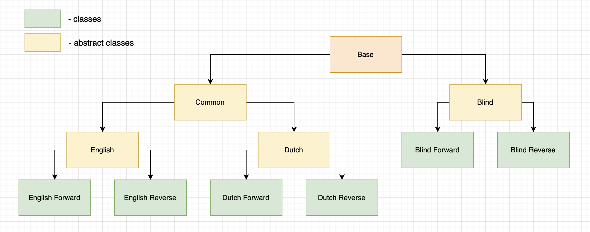
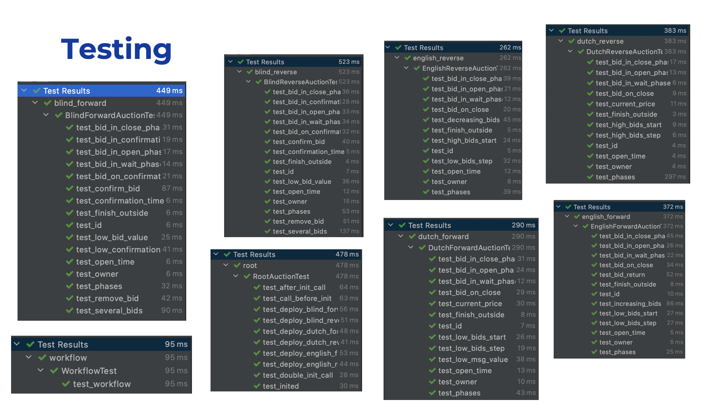
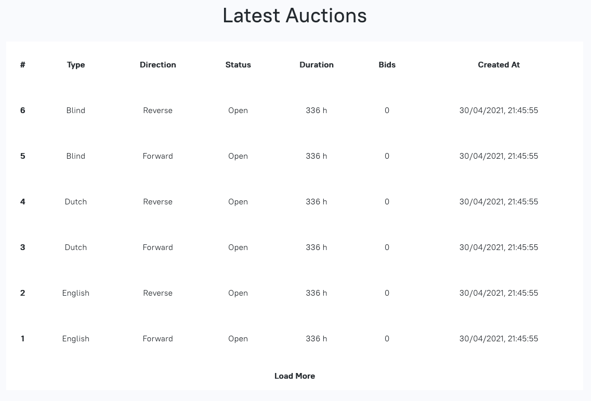
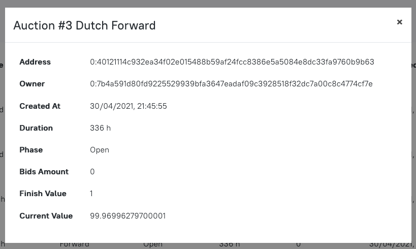
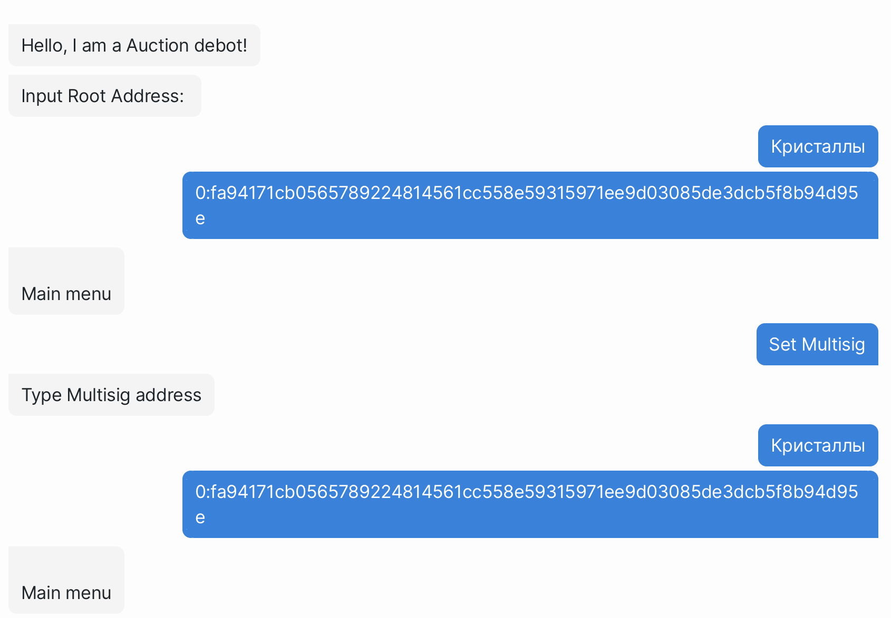
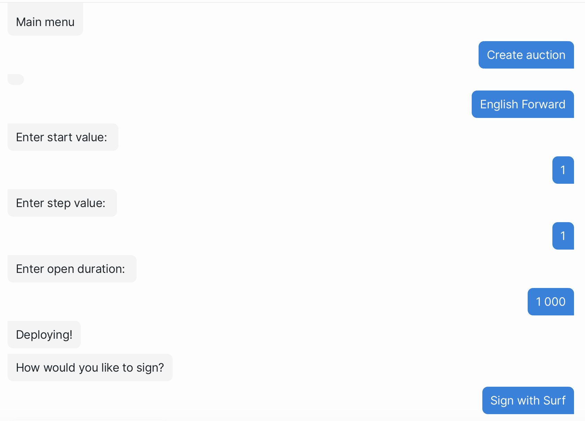
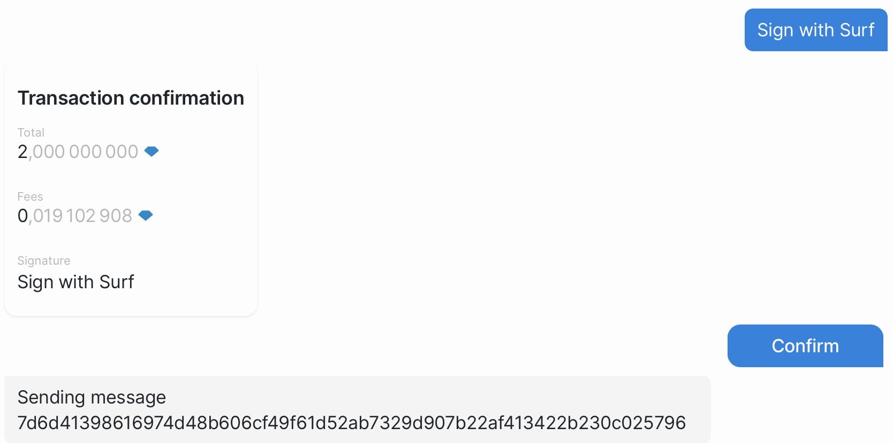
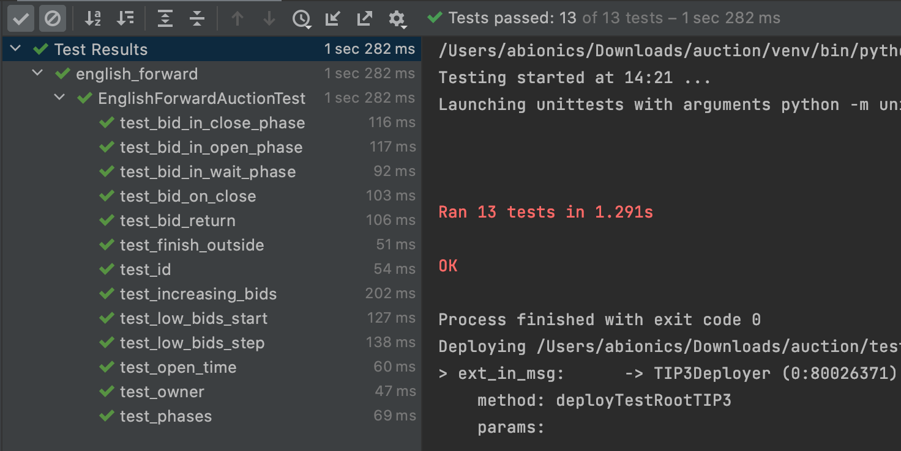

# Free TON online Auctions

Github: https://github.com/tonred/auction

Viewer mainnet**: https://auction-viewer.ton.red/?network=main.ton.dev&root=0:3d3efe33d552f2ebc2cafb9fbe8547b929c557426eed4dd68d37a9b933d1b118

Root address in mainnet*: `0:3d3efe33d552f2ebc2cafb9fbe8547b929c557426eed4dd68d37a9b933d1b118`

DeBot address in mainnet*: `0:b7ab4ab8db821a73c2e7d14ac8545f7900a0d6e176d169489fee0ba8038a006d`

TG: @Abionics


*Addresses for testnet is same, but testnet is often rebooted. You can contact us in TG and we will redeploy
**[Testnet viewer](https://auction-viewer.ton.red/?network=dev.ton.dev&root=0:3d3efe33d552f2ebc2cafb9fbe8547b929c557426eed4dd68d37a9b933d1b118)

## Key features:
* Six types of auctions
* Custom configuration of each auction
* Infinity amount of auctions and bids, no mapping
* Well-tested using `ts4`
* Browser viewer for deployed auctions

## Build and run

### Requirements:
* tondev
* tvm-linker
* python `>=3.7`
* `ts4==0.3.0`
* nodejs

### Setup environment
Copy `.env.dist` to `.env` and change variables up to you
* `SOLC_BIN` - path to solc binary file
* `TVM_LINKER_BIN` - path to tvm-linker binary file
* `STDLIB_PATH` - path to `stdlib_sol.tvm` lib 
* `NETWORK` - DApp server address or Node SE 

Install node js dependencies:
```shell
npm install
```

Install test suit 4 and ton client:
```shell
pip install -r test/ts4/requirements.txt
```

For view all make instructions:
```shell
make help
```

Compile and test:
```shell
make build
make tests
```

## Deployment

```shell
make deploy-root
make deploy-debot
```

## Structure

Contract classes dependencies (as well as test classes) are displayed on this image.
Easy to extend and add new auction types



## Types of auctions

### English Forward
Most common type of auction. There are start value and step value.
Every bid must be greater than previous on this step value (or more).
The winner is a person with the highest bid.
Every bid must be confirmed by real crystals in a message.
When somebody makes a bid more than your bid, you will get back your crystals values for the previous bid.

In root use method `deployEnglishForwardAuction` or `deployEnglishForwardAuctionCustom` to create auction.
Use method `makeBid` in auction to submit a bid

<details>
<summary>Click to learn more about methods</summary>

```solidity
// Root
function deployEnglishForwardAuction(uint128 startValue, uint128 stepValue, uint32 startTime, uint32 openDuration);
function deployEnglishForwardAuctionCustom(address owner, uint128 fee, uint128 startValue, uint128 stepValue, uint32 startTime, uint32 openDuration);
// Auction
function makeBid(uint128 value);
```

</details>

### English Reverse

There are start value and step value. 
Every bid must be lower than previous on this step value (or more).
Winner is a person with the lowest bid.
Bids must not be confirmed by real crystals.

In root use method `deployEnglishReverseAuction` or `deployEnglishReverseAuctionCustom` to create auction.
Use method `makeBid` in auction to submit a bid

<details>
<summary>Click to learn more about methods</summary>

```solidity
// Root
function deployEnglishReverseAuction(uint128 startValue, uint128 stepValue, uint32 startTime, uint32 openDuration);
function deployEnglishReverseAuctionCustom(address owner, uint128 fee, uint128 startValue, uint128 stepValue, uint32 startTime, uint32 openDuration);
// Auction
function makeBid(uint128 value);
```

</details>

### Dutch Forward

You must set start and finish values in a constructor.
Bid price decreases from bigger (start) to smaller (finish) value.
You can get this life-time price via `getCurrentPrice` method.
More time passes - the lower price you need to bid.
Every bid must be confirmed by real crystals in a message.
Winner is a first person who make a bid.

In root use method `deployDutchForwardAuction` or `deployDutchForwardAuctionCustom` to create auction.
Use method `buy` in auction to submit a bid (and make a buy)

<details>
<summary>Click to learn more about methods</summary>

```solidity
// Root
function deployDutchForwardAuction(uint128 startValue, uint128 finishValue, uint32 startTime, uint32 openDuration);
function deployDutchForwardAuctionCustom(address owner, uint128 fee, uint128 startValue, uint128 finishValue, uint32 startTime, uint32 openDuration);
// Auction
function buy(uint128 value);
```

</details>

### Dutch Reverse

You must set start and finish values in a constructor.
Bid price increases from smaller (start) to bigger (finish) value.
You can get this life-time price via `getCurrentPrice` method.
More time passes - the bigger price you need to bid.
Bids must not be confirmed by real crystals.
Winner is a first person who make a bid.

In root use method `deployDutchReverseAuction` or `deployDutchReverseAuctionCustom` to create auction.
Use method `buy` in auction to submit a bid (and make a buy)

<details>
<summary>Click to learn more about methods</summary>

```solidity
// Root
function deployDutchReverseAuction(uint128 startValue, uint128 finishValue, uint32 startTime, uint32 openDuration);
function deployDutchReverseAuctionCustom(address owner, uint128 fee, uint128 startValue, uint128 finishValue, uint32 startTime, uint32 openDuration);
// Auction
function buy(uint128 value);
```

</details>

### Blind Forward

Firstly you must make your bid in OPEN phase.
To do this, you must generate random salt, locally encode your bid via `calcBidHash` method and then send this hash.
After then, you must wait for CONFIRMATION phase and confirm your bid.
In this step you must send your salt, bid value and crystals.
This algorithm guarantees that nobody will see your bid in OPEN phase.
In CONFIRMATION phase nobody can do a new bid.
You can remove your bid in OPEN phase.
Winner is a person with the highest bid.

**Important:** there is a deposit value that you should to submit when you make a bid.
This deposit will be returned after confirmation.
It is used to prevent spamming, when someone creates a lot of blind bids but don't confirm they.

In root use method `deployBlindForwardAuction` or `deployBlindForwardAuctionCustom` to create auction.
Use method `makeBid`, `removeBid` and `confirmBid` in auction

<details>
<summary>Click to learn more about methods</summary>

```solidity
// Root
function deployBlindForwardAuction(uint32 startTime, uint32 openDuration, uint32 confirmationDuration);
function deployBlindForwardAuctionCustom(address owner, uint128 fee, uint128 deposit, uint32 startTime, uint32 openDuration, uint32 confirmationDuration);
// Auction
function makeBid(uint256 hash);
function removeBid(uint256 hash);
function confirmBid(uint128 value, uint256 salt);
function calcBidHash(uint128 value, uint256 salt);  // call off-chain for secure
```

</details>

### Blind Reverse

Firstly you must make your bid in OPEN phase.
To do this, you must generate random salt, locally encode your bid via `calcBidHash` method and then send this hash.
After then, you must wait for CONFIRMATION phase and confirm your bid.
In this step you must send your salt and bid value.
This algorithm guarantees that nobody will see your bid in OPEN phase.
In CONFIRMATION phase nobody can do a new bid.
You can remove your bid in OPEN phase.
Winner is a person with the lowest bid.

**Important:** there is a deposit value that you should to submit when you make a bid.
This deposit will be returned after confirmation.
It is used to prevent spamming, when someone creates a lot of blind bids but don't confirm they.

In root use method `deployBlindReverseAuction` or `deployBlindReverseAuctionCustom` to create auction.
Use method `makeBid`, `removeBid` and `confirmBid` in auction

<details>
<summary>Click to learn more about methods</summary>

```solidity
// Root
function deployBlindReverseAuction(uint32 startTime, uint32 openDuration, uint32 confirmationDuration);
function deployBlindReverseAuctionCustom(address owner, uint128 fee, uint128 deposit, uint32 startTime, uint32 openDuration, uint32 confirmationDuration);
// Auction
function makeBid(uint256 hash);
function removeBid(uint256 hash);
function confirmBid(uint128 value, uint256 salt);
function calcBidHash(uint128 value, uint256 salt);  // call off-chain for secure
```

</details>

## Tests

To run tests use:
```shell
make tests
```

After updates in tests, run `errors_generator.py` to update python error's class

Test is written on python using `unittest` and `tonos-ts4` libraries.
There are tests for each type of auction (name of files in equals to auction type), and separate tests for root in `root.py`.
Moreover, there is an integration test for all workflow in `workflow.py`.
Test classes inheritance structure is the same as in auction



## Viewer

Viewer listen for events and display all auctions from root in one table.
You can click on any auction to see more info




## Debot

**! Important !** You must call "Set Multisig” before deploying any type of auction





## TIP3

In branch `tip3` there is a demo of a TIP3 English Forward Auction.
It contains `ts4` tests.
Another auctions will be done in such way.
Used broxus TIP3 implementation (see realization [here](https://github.com/broxus/ton-eth-bridge-token-contracts/tree/master/free-ton/contracts) - 
RootTokenContract.sol and TONTokenWallet.sol contacts)


